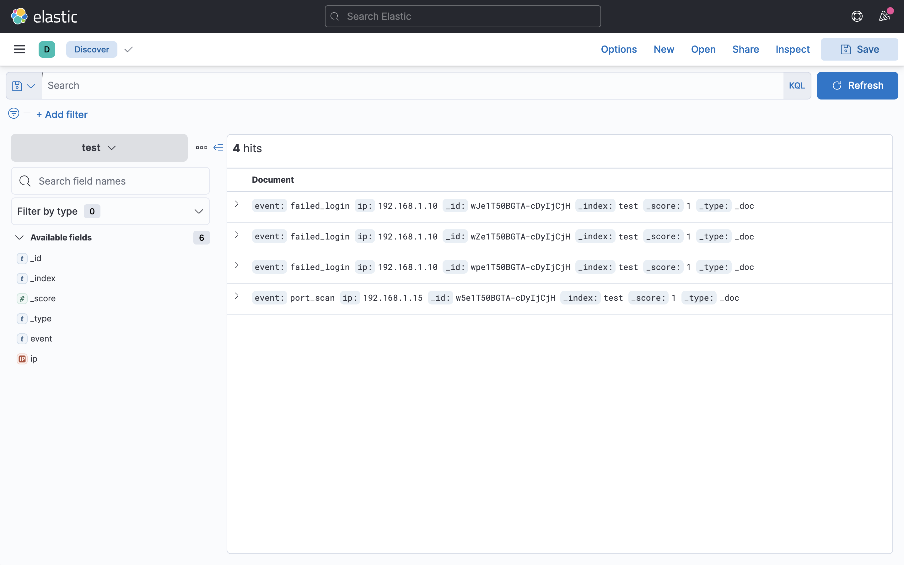
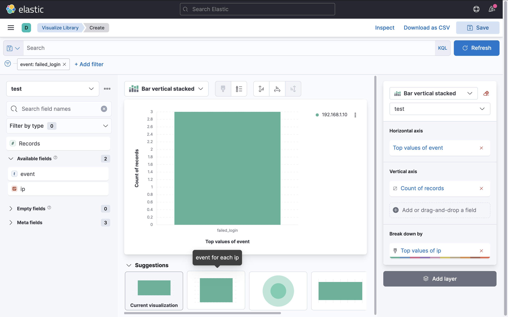

# 🔐 SIEM Project – Log Analysis & Threat Detection using ELK Stack

## 📌 About This Project

I built this project to understand how a basic SIEM (Security Information and Event Management) system works in a real-world scenario.

Instead of just learning theory, I wanted to actually see how logs are collected, analyzed, and used to detect suspicious activity like brute-force attacks or port scanning.

---

## ⚙️ What I Did

- Set up Elasticsearch and Kibana using Docker  
- Generated sample security logs (failed login attempts, port scan activity)  
- Uploaded logs into Elasticsearch  
- Used Kibana to explore and analyze the data  
- Created visualizations to detect patterns  

---

## 🔍 What I Observed

While analyzing the logs, I found:

- Multiple failed login attempts coming from the same IP (`192.168.1.10`)  
- This pattern clearly indicates a possible brute-force attack  
- I also noticed a port scan event from another IP, which could be reconnaissance activity  

---

## 📊 Visual Analysis

### 🔹 Raw Logs (Discover View)

### 🔹 Failed Login Detection

### 🔹 Dashboard Visualization

---

## 🛠️ Tools Used

- Elasticsearch  
- Kibana  
- Docker  

---

## 🧠 What I Learned

- How logs are ingested and indexed in a SIEM system  
- How to filter and analyze logs in Kibana  
- How to detect suspicious patterns like brute-force attacks  
- Importance of visualization in security monitoring  

---

## 🚀 Why This Project Matters

This project helped me move beyond theory and actually understand how SOC analysts work with logs in real environments.

It gave me hands-on exposure to:
- Log analysis  
- Threat detection  
- Basic SIEM workflow  

---

## 📌 Next Improvements (Planned)

- Add more realistic logs (larger dataset)  
- Simulate real-time log ingestion  
- Explore alerting features in Kibana  

---

## 👨‍💻 Author

Swapnil  
